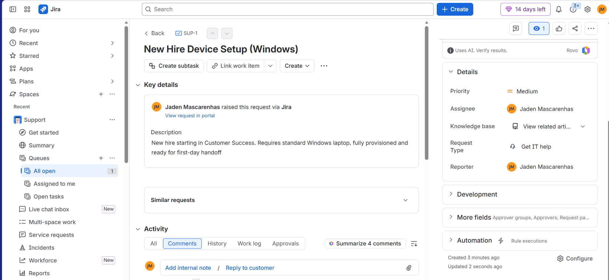
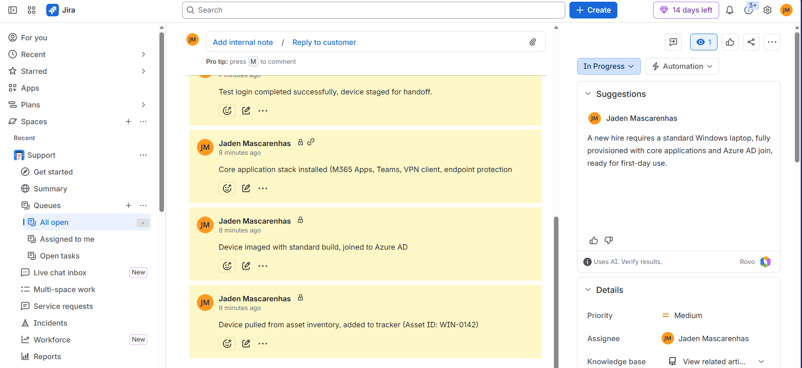
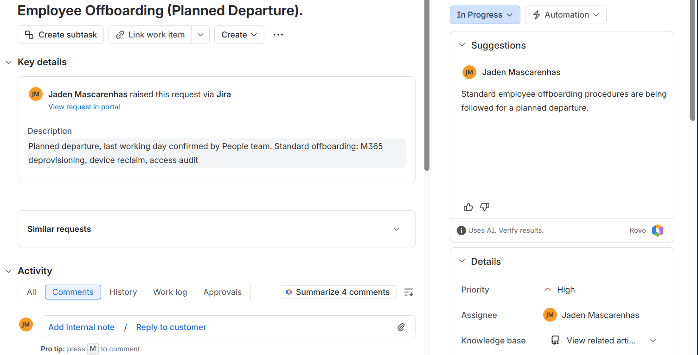
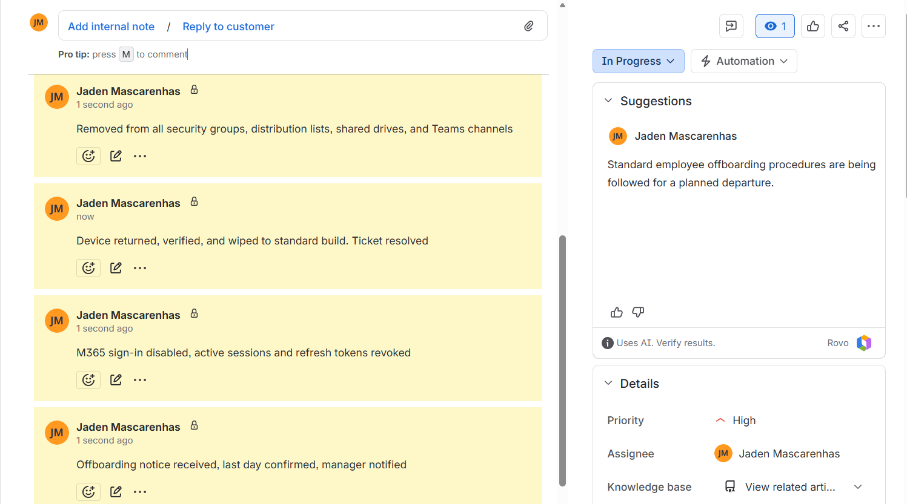

# IT Onboarding & Offboarding Runbook

A self-directed lab simulating end-to-end employee lifecycle IT operations, built to reflect real day-to-day IT Support Engineer work: ticket-driven onboarding/offboarding, cross-platform provisioning (Windows + macOS), M365 access management, and SLA-tracked resolution.

## Why I built this

Most applications for IT support roles list skills without showing the actual workflow behind them. This repo is the workflow: real tickets, real checklists, real SLA timestamps, run against a live ticketing system (Jira Service Management) rather than described in the abstract.

## What's inside

- **`sample-tickets/`** — Four full ticket lifecycles (new hire Windows setup, new hire M365 provisioning, employee offboarding, access issue troubleshooting), each logged with timestamps against SLA targets.
- **`checklists/`** — Step-by-step onboarding and offboarding checklists covering account provisioning, device setup, and secure deprovisioning across Windows and macOS.
- **`kb-articles/`** — Short internal-style knowledge base articles a new IT team member or end user could follow directly.
- **`assets/`** — Screenshots from a live Jira Service Management instance: two tickets (SUP-1 onboarding, SUP-2 offboarding) each with a full comment timeline, priority, and status.

## Live ticket screenshots

**SUP-1 — New Hire Device Setup (Windows)**

**SUP-2 — Employee Offboarding (Planned Departure)**

## Scope and honesty note

This was built as a solo lab exercise, not inside a live company environment. Windows-side steps were run and screenshotted on a live Windows machine and M365 developer tenant. macOS-side steps are documented to the same operational standard (Apple Business Manager enrollment, FileVault, account configuration) based on Apple's official admin documentation, since I didn't have a physical Mac available to run them live — this is flagged rather than presented as hands-on device time.

## Tools used

- Jira Service Management (ITSM ticketing, free tier)
- Microsoft 365 Developer Tenant (user provisioning, conditional access, M365 admin center)
- Apple Business Manager / macOS admin documentation (offboarding/onboarding reference)

## Skills this demonstrates

| Skill | Where |
|---|---|
| Ticketing/SLA-driven support | `sample-tickets/` |
| M365 user provisioning & access management | `sample-tickets/02-new-hire-m365.md`, `checklists/onboarding-checklist.md` |
| Windows troubleshooting | `sample-tickets/04-access-issue-windows.md` |
| macOS environment management | `checklists/onboarding-checklist.md`, `checklists/offboarding-checklist.md` |
| Onboarding/offboarding ownership | `checklists/` |
| Documentation | `kb-articles/` |

---
Jaden Mascarenhas — [LinkedIn](https://linkedin.com/in/jaden-mascarenhas-989b6a254) | [GitHub](https://github.com/jaden-mas1010) | [Portfolio](https://jaden-mas1010.github.io)|https://youtu.be/tdhzgWCZHko?is=9x2j_wzyURtl7_rI

